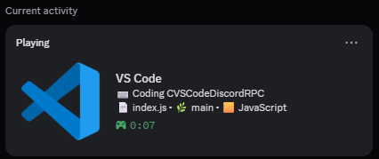
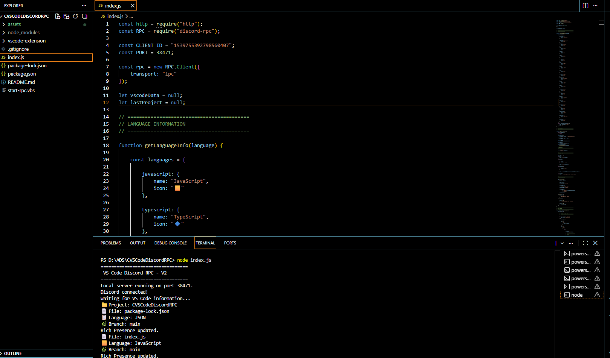

# VS Code Discord RPC

A VS Code extension that automatically displays your current coding activity on Discord using Rich Presence.

It detects your current project, file, programming language, and Git branch, keeping your Discord status automatically synchronized with your VS Code workspace.

## Current Version - v1.0.1

The project has evolved from a simple Node.js prototype into a standalone VS Code extension that runs directly inside VS Code.

### Before

The original implementation required manually running a Node.js script:

```bash
node index.js
```

The script had to remain running in the background to keep the Discord Rich Presence active.

### Now

The new implementation runs entirely as a VS Code extension.

**Install the extension -> open VS Code -> Discord Rich Presence starts automatically.**

No background terminal, no manual Node.js command, and no additional launcher required.

---

## Features

* Automatic project/workspace detection
* Displays the currently opened file
* Detects the programming language
* Detects the current Git branch
* Automatically updates Discord Rich Presence
* Runs directly inside VS Code
* Uses Discord IPC for communication
* Distributed as a `.vsix` extension

---

## Preview

### Discord Rich Presence

<p align="center">
  
</p>

### VS Code Integration

<p align="center">
  
</p>

---

## Installation

### From VSIX

1. Download the latest `.vsix` file from the repository.
2. Open Visual Studio Code.
3. Press `Ctrl + Shift + P`.
4. Select `Extensions: Install from VSIX...`.
5. Select the downloaded `.vsix` file.
6. Make sure the Discord desktop application is running.
7. Open a project in VS Code.

The extension will automatically connect to Discord and update your Rich Presence.

---

## Development

Clone the repository:

```bash
git clone https://github.com/renanvelc/vscode-discord-rpc.git
```

Open the extension directory:

```bash
cd vscode-discord-rpc/vscode-extension
```

Install dependencies:

```bash
npm install
```

Open the project in VS Code:

```bash
code .
```

Press:

```F5```

This launches the **Extension Development Host**, allowing the extension to be tested without installing the `.vsix`.

---

## How It Works

The extension runs inside VS Code's Extension Host and collects information from the current workspace.

```
VS Code
  |
  | Workspace
  | File
  | Language
  | Git Branch
  v
VS Code Extension
  |
  | Discord IPC
  v
Discord
  |
  v
Rich Presence
```

The extension automatically updates the activity whenever the relevant VS Code information changes.

---

## Project Evolution

### Prototype

The first version was built as a standalone Node.js application.

It required:

```bash
node index.js
```

and depended on a separate launcher to keep the process running.

This version is preserved in the [`legacy`](legacy/) directory for reference.

### Extension

The project was redesigned around the VS Code Extension API.

The new architecture removes the need for an external Node.js process and integrates the Discord RPC directly into VS Code.

This makes the installation and usage significantly simpler.

---

## Project Structure

```
vscode-discord-rpc/
|
+-- assets/
|
+-- legacy/
|   +-- index.js
|   +-- package.json
|   +-- package-lock.json
|   +-- start-rpc.vbs
|
+-- vscode-extension/
|   +-- extension.js
|   +-- package.json
|   +-- LICENSE.txt
|   +-- .vscodeignore
|
+-- .gitignore
+-- README.md
```

---

## Technologies

* JavaScript
* Node.js
* VS Code Extension API
* Discord Rich Presence
* Discord IPC
* Git

---

## License

This project is licensed under the MIT License.